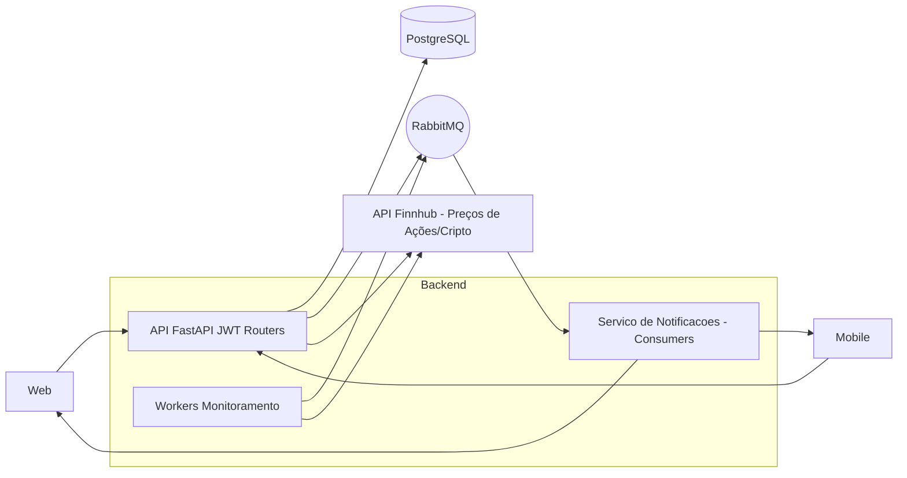

# Arquitetura do Sistema – KontaTech

**Componentes**
- Frontend Web/Mobile: chama API via HTTP.
- Backend FastAPI: JWT e routers `auth`, `usuarios`, `grupos`, `despesas`.
- PostgreSQL: persistência via SQLAlchemy; migrações via Alembic.
- RabbitMQ: eventos com Consumers/Workers.
- API Finnhub: integração externa para monitorar preços de ativos (ações/cripto).
- Serviço de Notificações: consome RabbitMQ e entrega notificações aos usuários.

**Nota sobre Consumers e conexões**
- Consumers/Workers são parte do backend (não do frontend) e consomem mensagens do RabbitMQ para executar ações assíncronas.
- Os Consumers focam em notificações: não escrevem no banco; apenas consomem eventos e entregam ao usuário.

**Fluxos**
- Autenticar e obter JWT em `auth`.
- CRUD via routers, persistindo no PostgreSQL.
- Notificar quando: (1) despesa envolve o usuário; (2) ativo monitorado atinge preço alvo; (3) prazo da wishlist expira.
- API/Workers consultam a API Finnhub para monitoramento de preço de ativos.
