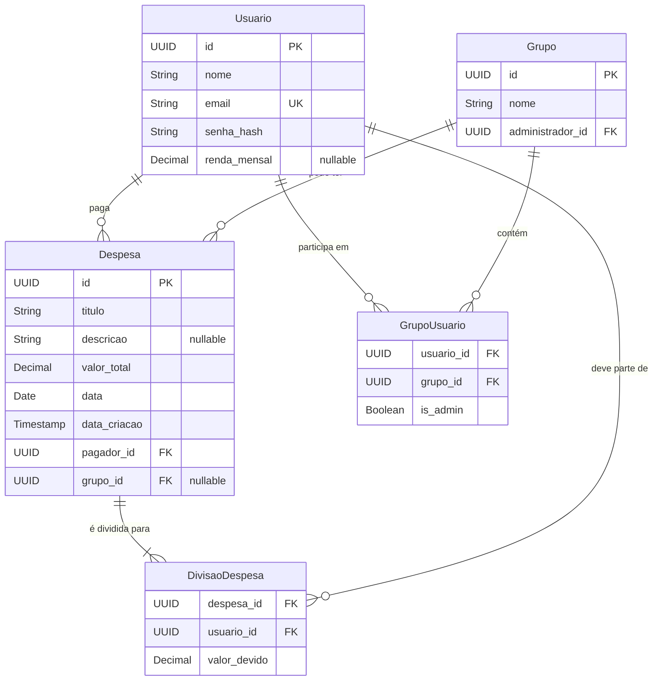
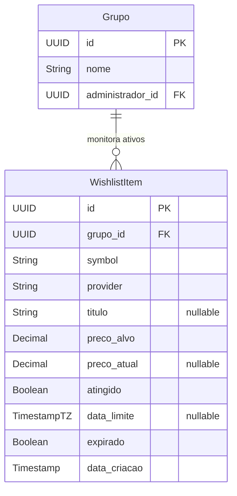

# Documentação de Entidades e Relacionamentos

Este documento descreve as principais entidades do sistema, seus atributos e os relacionamentos entre elas. O objetivo é servir como base para a construção do banco de dados e das APIs.

## Entidades Principais

### 4. WishlistItem (Investimentos)

Representa um ativo financeiro monitorado pelo grupo na wishlist de investimentos.

#### Atributos

| Atributo | Tipo de Dado | Descrição | Obrigatório? |
| :--- | :--- | :--- | :--- |
| `id` | UUID / Integer | Identificador único do item de wishlist. | ✅ Sim |
| `grupo_id` | FK (Grupo) | Grupo ao qual o item pertence. | ✅ Sim |
| `symbol` | String | Símbolo do ativo (ex.: `AAPL`, `PETR4.SA`, `BINANCE:BTCUSDT`). | ✅ Sim |
| `provider` | String | Provedora dos dados de preço (ex.: `FINNHUB`). | ✅ Sim |
| `titulo` | String | Nome amigável do ativo (opcional, pode vir da API). | ❌ Não |
| `preco_alvo` | Decimal | Preço alvo para notificação. | ✅ Sim |
| `preco_atual` | Decimal | Último preço consultado. | ❌ Não |
| `atingido` | Boolean | Indica se o preço alvo foi atingido. | ✅ Sim (default false) |
| `data_limite` | Timestamp (TZ) | Prazo para monitoramento do item. | ❌ Não |
| `expirado` | Boolean | Indica se o item passou do prazo e expirou. | ✅ Sim (default false) |
| `data_criacao` | Timestamp | Data de criação do registro. | ✅ Sim |

* **Comportamento:** o worker periódico consulta preços via Finnhub e, quando `preco_atual <= preco_alvo`, marca `atingido=true` e notifica o grupo. Se `data_limite` passar, marca `expirado=true` e também notifica.

### 1. Usuario

Representa um usuário final do sistema.

#### Atributos

| Atributo | Tipo de Dado | Descrição | Obrigatório? |
| :--- | :--- | :--- | :--- |
| `id` | UUID / Integer | Identificador único do usuário (Chave Primária). | ✅ Sim |
| `nome` | String | Nome completo do usuário. | ✅ Sim |
| `email` | String | E-mail de login do usuário. Deve ser único. | ✅ Sim |
| `senha_hash` | String | Senha do usuário armazenada de forma segura (hash). | ✅ Sim |
| `renda_mensal` | Decimal | Renda mensal informada pelo usuário. | ❌ Não |

---

### 2. Grupo

Representa um conjunto de usuários que compartilham despesas (ex: família, república).

#### Atributos

| Atributo | Tipo de Dado | Descrição | Obrigatório? |
| :--- | :--- | :--- | :--- |
| `id` | UUID / Integer | Identificador único do grupo (Chave Primária). | ✅ Sim |
| `nome` | String | Nome do grupo. | ✅ Sim |
| `administrador_id` | FK (Usuario) | Usuário administrador original (criador do grupo). | ✅ Sim |

---

### 3. Despesa

Representa um gasto individual ou de um grupo.

#### Atributos

| Atributo | Tipo de Dado | Descrição | Obrigatório? |
| :--- | :--- | :--- | :--- |
| `id` | UUID / Integer | Identificador único da despesa (Chave Primária). | ✅ Sim |
| `titulo` | String | Um nome curto para a despesa (ex: "Almoço", "Conta de Luz"). | ✅ Sim |
| `descricao` | String | Detalhes adicionais sobre a despesa. | ❌ Não |
| `valor_total` | Decimal | O valor monetário total da despesa. | ✅ Sim |
| `data` | Date | A data em que a despesa ocorreu. | ✅ Sim |
| `pagador_id` | FK (Usuario) | ID do usuário que efetuou o pagamento da despesa. | ✅ Sim |
| `grupo_id` | FK (Grupo) | ID do grupo ao qual a despesa pertence. | ❌ Não |
| `data_criacao` | Timestamp | Data e hora em que o registro foi criado. | ✅ Sim |

* **Nota:** O campo `grupo_id` é opcional para permitir que um usuário cadastre despesas pessoais que não pertencem a nenhum grupo.

---

## Relacionamentos e Tabelas de Ligação

### 1. Relacionamento: `Usuario` <> `Grupo`

Um usuário pode participar de vários grupos, e um grupo deve ter pelo menos dois usuários.

#### Tabela `GrupoUsuario`

| Atributo | Tipo de Dado | Descrição |
| :--- | :--- | :--- |
| `usuario_id` | FK (Usuario) | Chave estrangeira referenciando o usuário. |
| `grupo_id` | FK (Grupo) | Chave estrangeira referenciando o grupo. |
| `is_admin` | Boolean | Indica se o usuário é administrador do grupo. |

### 2. Relacionamento: `Despesa` <> `Usuario` (Divisão)

Esta é a tabela que define **quais usuários específicos participaram de uma despesa** e como o valor foi dividido entre eles. Isso permite que uma despesa associada a um grupo envolva apenas um subconjunto de seus membros.

#### Tabela `DivisaoDespesa`

| Atributo | Tipo de Dado | Descrição |
| :--- | :--- | :--- |
| `id` | UUID / Integer | Identificador único da entrada de divisão. |
| `despesa_id` | FK (Despesa) | Chave estrangeira referenciando a despesa. |
| `usuario_id` | FK (Usuario) | Chave estrangeira referenciando o usuário que deve pagar. |
| `valor_devido` | Decimal | O valor exato que este usuário deve pagar. |

* **Regra de Negócio:** Ao cadastrar uma despesa, a soma de `valor_devido` na tabela `DivisaoDespesa` para uma `despesa_id` específica **deve ser igual** ao `valor_total` na tabela `Despesa`. O frontend ou backend será responsável por calcular o `valor_devido` a partir das porcentagens ou valores customizados informados pelo usuário.

### Regras de Administração de Grupo

- Ao criar um grupo, o usuário autenticado é definido como **administrador original** (`administrador_id`) e também como **administrador** na relação `GrupoUsuario` (`is_admin = true`).
- Somente o **administrador original** pode promover outros membros do grupo ao papel de **administrador**.
- Apenas **administradores** do grupo podem **adicionar novos membros** ao grupo.
- Operações de atualização de dados do grupo (ex.: alterar `nome`) são permitidas apenas para **administradores**.
- A exclusão de um grupo só pode ser realizada pelo **administrador original** e deve respeitar integridade referencial (não excluir se houver despesas associadas ao grupo).

### Diagrama de Entidade-Relacionamento (DER)

#### DER atualizado (inclui WishlistItem)

