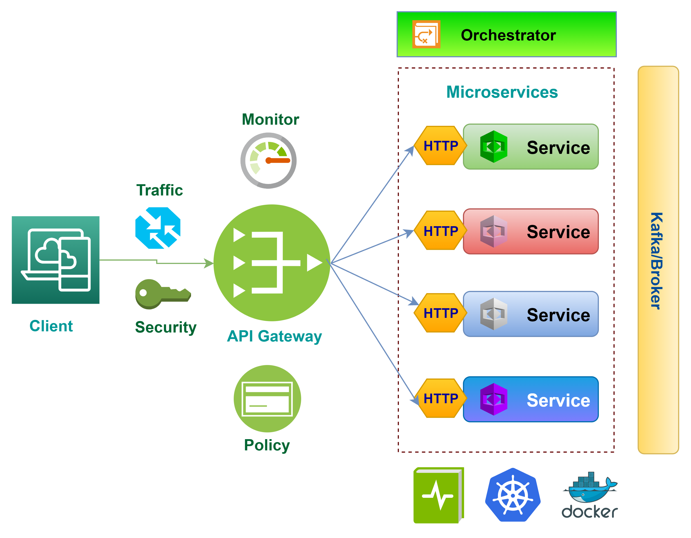
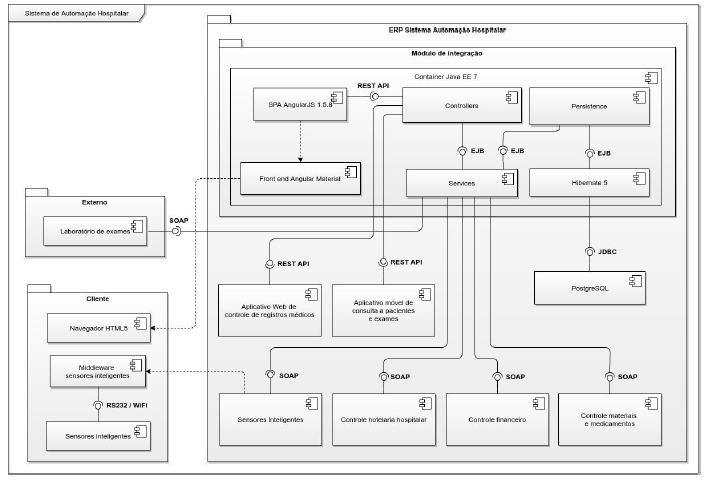

# KontaTech

**Davi Érico dos Santos, davi.erico@sga.pucminas.br**

**Felipe Corrêa, famcorrea@sga.pucminas.br**

**João Augusto Aquino, 1272596@sga.pucminas.br**

**Leandro Pacheco, lcpacheco@sga.pucminas.br**

**Lucas Maia, lmaiarocha23@gmail.com**

**Lucas Valente, lucasvalves35@gmail.com**

---

Professores:

**Prof. Artur Mol**

**Prof. Leonardo Vilela**

---

\_Curso de Engenharia de Software, Campus Coração Eucarístico

_Instituto de Informática e Ciências Exatas – Pontifícia Universidade de Minas Gerais (PUC MINAS), Belo Horizonte – MG – Brasil_

---

_**Resumo**. Este trabalho apresenta a arquitetura de software do KontaTech, um sistema de gestão financeira pessoal e em grupo desenvolvido para ajudar usuários a controlar despesas e alcançar metas de economia. O sistema permite que usuários se cadastrem, criem ou participem de grupos (família, colegas de república) e visualizem despesas compartilhadas. As principais funcionalidades incluem cadastro e divisão de despesas, definição de metas de economia mensais, criação de wishlist de produtos desejados, acompanhamento de investimentos e geração de relatórios financeiros detalhados. O projeto utiliza Apache Kafka para implementar notificações em tempo real, incluindo monitoramento de preços de produtos e alertas de novas despesas para membros do grupo. O sistema também oferece uma calculadora que estima o tempo necessário para adquirir itens da wishlist com base nas metas de economia estabelecidas. Este documento arquitetural descreve as decisões de design, requisitos funcionais e não-funcionais, e a estrutura técnica necessária para implementar esta solução de gestão financeira colaborativa._

---

## Histórico de Revisões

| **Data**         | **Autor** | **Descrição**               | **Versão** |
| ---------------- | --------- | --------------------------- | ---------- |
| **[23/09/2025]** | [Leandro] | [Primeira Entrega Sprint 1] | [1.0]      |
|                  |           |                             |            |
|                  |           |                             |            |

## SUMÁRIO

1. [Apresentação](#apresentacao "Apresentação")  
   1.1. Problema  
   1.2. Objetivos do trabalho  
   1.3. Definições e Abreviaturas  

2. [Nosso Produto](#produto "Nosso Produto")  
   2.1. Visão do Produto  
   2.2. Nosso Produto  
   2.3. Personas  

3. [Requisitos](#requisitos "Requisitos")  
   3.1. Requisitos Funcionais  
   3.2. Requisitos Não-Funcionais  
   3.3. Restrições Arquiteturais  
   3.4. Mecanismos Arquiteturais  

4. [Modelagem](#modelagem "Modelagem e projeto arquitetural")  
   4.1. Visão de Negócio  
   4.2. Visão Lógica  
   4.3. Modelo de dados (opcional)  

5. [Wireframes](#wireframes "Wireframes")  

6. [Solução](#solucao "Projeto da Solução")  

7. [Avaliação](#avaliacao "Avaliação da Arquitetura")  
   7.1. Cenários  
   7.2. Avaliação  

8. [Referências](#referencias "REFERÊNCIAS") 

9. [Apêndices](#apendices "APÊNDICES") 
   9.1 Ferramentas  

# 1. Apresentação

O controle financeiro pessoal e familiar representa um dos maiores desafios da vida moderna. Segundo pesquisa do Serasa (2023), 70% dos brasileiros não conseguem controlar adequadamente seus gastos mensais, e 45% das famílias brasileiras estão endividadas. A falta de ferramentas adequadas para gestão financeira colaborativa, especialmente para grupos como famílias, casais e colegas de república, agrava essa situação. Muitas pessoas utilizam planilhas desatualizadas ou aplicativos que não permitem compartilhamento eficiente de informações financeiras entre membros do grupo, resultando em conflitos e descontrole orçamentário.

## 1.1. Problema

A gestão financeira colaborativa enfrenta diversos obstáculos: ausência de transparência nos gastos compartilhados, dificuldade para dividir despesas de forma justa entre membros de um grupo, falta de acompanhamento de metas de economia coletivas, e inexistência de ferramentas que integrem controle de gastos com monitoramento de preços de produtos desejados. Além disso, a maioria das soluções existentes não oferece notificações em tempo real sobre movimentações financeiras do grupo, prejudicando a comunicação e o planejamento financeiro conjunto. Esses problemas resultam em conflitos interpessoais, metas financeiras não alcançadas e decisões de compra impulsivas que comprometem o orçamento familiar ou do grupo.

## 1.2. Objetivos do trabalho

O objetivo geral deste trabalho é apresentar a descrição do projeto arquitetural do sistema KontaTech, uma aplicação de gestão financeira pessoal e em grupo. Os objetivos específicos incluem: (1) definir a arquitetura de software que suporte funcionalidades de gestão financeira colaborativa com notificações em tempo real utilizando Apache Kafka; (2) especificar os componentes arquiteturais necessários para integração com APIs externas de monitoramento de preços e cotações financeiras; (3) projetar a estrutura de dados que permita compartilhamento seguro de informações financeiras entre membros de grupos; (4) definir os mecanismos de segurança e controle de acesso para proteger dados financeiros sensíveis; e (5) estabelecer os padrões arquiteturais que garantam escalabilidade e performance para suportar múltiplos grupos e usuários simultâneos.

## 1.3. Definições e Abreviaturas

**API** - Application Programming Interface (Interface de Programação de Aplicações)

**Kafka** - Plataforma de streaming distribuída para processamento de eventos em tempo real

**RF** - Requisito Funcional

**RNF** - Requisito Não-Funcional

**Wishlist** - Lista de desejos de produtos que o usuário pretende adquirir

**Grupo Financeiro** - Conjunto de usuários que compartilham despesas e metas financeiras (ex: família, casal, república)

**Meta de Economia** - Valor monetário que o usuário ou grupo pretende economizar em um período determinado

**Divisão de Despesas** - Funcionalidade que permite repartir custos entre membros de um grupo de forma proporcional ou igualitária

# 2. Nosso Produto

Esta seção explora o produto KontaTech, detalhando sua proposta de valor, funcionalidades principais e o perfil dos usuários-alvo.

## 2.1 Visão do Produto

O KontaTech é uma plataforma digital de gestão financeira colaborativa que revoluciona a forma como pessoas e grupos controlam suas finanças. Nossa visão é criar um ecossistema financeiro integrado que combine controle de gastos, planejamento de metas, monitoramento de investimentos e inteligência de mercado em uma única solução. O produto visa democratizar o acesso a ferramentas financeiras avançadas, permitindo que famílias, casais, colegas de república e grupos de amigos tenham controle total sobre suas finanças compartilhadas, com transparência, praticidade e tecnologia de ponta.

## 2.2 Nosso Produto

O KontaTech oferece uma suite completa de funcionalidades financeiras:

- **Gestão Colaborativa de Despesas** - permite cadastro, categorização e divisão automática de gastos entre membros do grupo
- **Metas de Economia Inteligentes** - define objetivos financeiros do grupo/indivíduo com acompanhamento em tempo real
- **Wishlist com Monitoramento de Preços** - utiliza Apache Kafka para rastrear preços de produtos desejados e notificar quando atingem valores-alvo
- **Portfolio de Investimentos** - cadastro e visualização dos investimentos do usuário ou grupo
- **Calculadora de Objetivos** - estima tempo necessário para adquirir itens da wishlist baseado nas metas de economia
- **Relatórios Financeiros Avançados** - gera análises detalhadas de gastos por categoria, membro e período
- **Notificações em Tempo Real** - alerta de novas despesas do grupo e oportunidades de compra

## 2.3 Personas

<h2>Persona 1 - Gestor Financeiro Familiar</h2>
<table>
  <tr>
    <td style="vertical-align: top; width: 150px;">
      
    </td>
    <td style="vertical-align: top; padding-left: 10px;">
      <strong>Nome:</strong> Carlos Silva  
      <strong>Idade:</strong> 35 anos  
      <strong>Hobby:</strong> Investir em ações e fundos imobiliários  
      <strong>Trabalho:</strong> Analista financeiro  
      <strong>Personalidade:</strong> Organizado, planejador e responsável  
      <strong>Sonho:</strong> Conquistar independência financeira para a família  
      <strong>Dores:</strong> Dificuldade para controlar gastos familiares e falta de transparência nas despesas do cônjuge  
    </td>
  </tr>
</table>

<h2>Persona 2 - Jovem Compartilhando Moradia</h2>
<table>
  <tr>
    <td style="vertical-align: top; width: 150px;">
  
    </td>
    <td style="vertical-align: top; padding-left: 10px;">
      <strong>Nome:</strong> Marina Santos  
      <strong>Idade:</strong> 23 anos  
      <strong>Hobby:</strong> Viajar e conhecer novos lugares  
      <strong>Trabalho:</strong> Estudante universitária e estagiária  
      <strong>Personalidade:</strong> Sociável, tecnológica e econômica  
      <strong>Sonho:</strong> Viajar para o exterior após a formatura  
      <strong>Dores:</strong> Conflitos com colegas de república sobre divisão de contas e dificuldade para economizar  
    </td>
  </tr>
</table>

<h2>Persona 2 - Jovem Registrando gastos Individuais</h2>
<table>
  <tr>
    <td style="vertical-align: top; width: 150px;">
  
    </td>
    <td style="vertical-align: top; padding-left: 10px;">
      <strong>Nome:</strong> Lucas Alves  
      <strong>Idade:</strong> 18 anos  
      <strong>Hobby:</strong> Jogar jogos online  
      <strong>Trabalho:</strong> Estudante universitário  
      <strong>Personalidade:</strong> Sociável, tecnológica e econômica  
      <strong>Sonho:</strong> Economizar para comprar um computador gamer  
      <strong>Dores:</strong> Dificuldade em achar um aplicativo que centralize o que ele precisa relacionado aos seus gastos e investimentos  
    </td>
  </tr>
</table>

# 3. Requisitos

Esta seção descreve os requisitos contemplados nesta descrição arquitetural do sistema KontaTech, divididos em requisitos funcionais e não funcionais, além das restrições arquiteturais e mecanismos que compõem a solução.

## 3.1. Requisitos Funcionais

Os requisitos funcionais do KontaTech foram organizados considerando as funcionalidades críticas para a definição arquitetural, especialmente aquelas que envolvem processamento em tempo real com Apache Kafka e integração com APIs externas.

| **ID** | **Descrição**                                                                                                                                                                                                                    | **Prioridade** | **Pontos** | **Plataforma** | **Status** |
| ------ | -------------------------------------------------------------------------------------------------------------------------------------------------------------------------------------------------------------------------------- | -------------- | ---------- | -------------- | ---------- |
| RF01   | Cadastro de Usuário e Grupos - O sistema deve permitir que usuários se cadastrem e possam criar ou participar de grupos (ex: família, casal, colegas de república)                                                               | alta           | 1          | web e mobile   | ⏳         |
| RF02   | Cadastro de Despesas - O sistema deve permitir o cadastro de despesas, com campos como: descrição, valor, data, categoria e responsável pelo gasto                                                                               | alta           | 1          | web e mobile   | ⏳         |
| RF03   | Visualização de Despesas por Grupo - Os usuários devem conseguir visualizar todas as despesas do grupo em uma lista ou gráfico                                                                                                   | alta           | 2          | web e mobile   | ⏳         |
| RF04   | Divisão de Despesas - O sistema deve permitir a divisão de despesas entre os membros do grupo (ex: dividir igualmente ou por porcentagem)                                                                                        | alta           | 2          | web e mobile   | ⏳         |
| RF05   | Metas de Economia - Usuários devem poder definir metas de economia mensais e acompanhar seu progresso                                                                                                                            | média          | 2          | web e mobile   | ⏳         |
| RF06   | Cadastro de Produtos Desejados (Wishlist) - Usuários podem cadastrar produtos que desejam comprar, com nome, valor máximo que aceitariam pagar e link do produto (opcional)                                                      | média          | 2          | web e mobile   | ⏳         |
| RF07   | Notificação de Gastos Excedentes - O sistema deve alertar o usuário caso ele ultrapasse um valor limite de gastos mensais definido previamente                                                                                   | média          | 2          | web e mobile   | ⏳         |
| RF08   | Relatórios Financeiros - O sistema deve gerar relatórios mensais com totais de gastos por categoria e membro do grupo                                                                                                            | média          | 3          | web e mobile   | ⏳         |
| RF09   | Cadastro e Acompanhamento de Investimentos - O sistema deve permitir que o usuário cadastre seus investimentos (ex: ações, fundos imobiliários, criptomoedas), informando o ativo, a quantidade e o preço médio de compra        | baixa          | 3          | web e mobile   | ⏳         |
| RF10   | Calculadora de "Quanto Falta?" - O sistema deve oferecer uma ferramenta simples onde o usuário seleciona um item da sua wishlist e o sistema calcula quanto tempo levaria para comprá-lo com base na sua meta de economia mensal | baixa          | 3          | web e mobile   | ⏳         |
| RF11   | Monitoramento de Preços em Tempo Real - Ao cadastrar um item na wishlist, o sistema deve utilizar Kafka para monitorar o preço do produto através de uma API gratuita                                                            | baixa          | 4          | web e mobile   | ⏳         |
| RF12   | Notificações em Tempo Real de Novas Despesas - Quando qualquer membro do grupo cadastrar uma nova despesa, Kafka deve emitir um evento que será consumido pelos outros membros do grupo                                          | baixa          | 4          | web e mobile   | ⏳         |

## 3.2. Requisitos Não-Funcionais

Os requisitos não-funcionais do KontaTech foram definidos considerando as limitações de um projeto universitário e focando nos aspectos mais essenciais para o funcionamento básico da aplicação.

| **ID** | **Descrição**                                                                                                 |
| ------ | ------------------------------------------------------------------------------------------------------------- |
| RNF001 | **Usabilidade** - A interface deve ser responsiva e funcionar adequadamente em dispositivos móveis e desktop  |
| RNF002 | **Performance** - O sistema deve responder às requisições dos usuários em tempo razoável (máximo 10 segundos) |
| RNF003 | **Segurança** - Os dados dos usuários devem ser protegidos com autenticação básica e conexões HTTPS           |

## 3.3. Restrições Arquiteturais

As restrições impostas ao projeto KontaTech que afetam diretamente sua arquitetura são:

- O backend deve ser desenvolvido em Python utilizando framework FastAPI;
- O frontend deve utilizar tecnologias Flutter;
- A comunicação da API deve seguir o padrão RESTful com documentação Swagger;
- O sistema de mensageria deve utilizar Apache Kafka para processamento de eventos em tempo real;
- O banco de dados deve ser relacional (PostgreSQL) para garantir consistência de dados financeiros;
- A aplicação deve ser containerizada usando Docker para facilitar deploy e escalabilidade;
- O sistema backend deve seguir arquitetura monolítica para facilitar o desenvolvimento e manutenção pelo grupo;
- Integração com APIs externas deve implementar tratamento de timeout e retry para resiliência.

## 3.4. Mecanismos Arquiteturais

Visão geral dos mecanismos que compõem a arquitetura do KontaTech, organizados em três camadas: análise, design e implementação.

| **Análise**        | **Design**                   | **Implementação**       |
| ------------------ | ---------------------------- | ----------------------- |
| Persistência       | ORM + Repository Pattern     | SQLAlchemy + PostgreSQL |
| Front end          | SPA + Component Architecture | Flutter                 |
| Back end           | API RESTful + Monolítico     | FastAPI + Python        |
| Mensageria         | Event-Driven Architecture    | Apache Kafka            |
| Autenticação       | JWT                          | Auth0                   |
| Deploy             | Containerização + CI/CD      | Docker                  |
| Integração Externa | HTTP Client + Timeout/Retry  | Requests                |

# 4. Modelagem e Projeto Arquitetural

_Apresente uma visão geral da solução proposta para o projeto e explique brevemente esse diagrama de visão geral, de forma textual. Esse diagrama não precisa seguir os padrões da UML, e deve ser completo e tão simples quanto possível, apresentando a macroarquitetura da solução._

**Figura 1 - Visão Geral da Solução (fonte: https://medium.com)**

Obs: substitua esta imagem por outra, adequada ao seu projeto (cada arquitetura é única).

## 4.1. Visão de Negócio (Funcionalidades)

_Apresente uma lista simples com as funcionalidades previstas no projeto (escopo do produto)._

1. O sistema deve...
2. O sistema deve...
3. ...

Obs: a quantidade e o escopo das funcionalidades deve ser negociado com os professores/orientadores do trabalho.

### Histórias de Usuário

_Nesta seção, você deve descrever estórias de usuários seguindo os métodos ágeis. Lembre-se das características de qualidade das estórias de usuários, ou seja, o que é preciso para descrever boas histórias de usuários._

Exemplos de Histórias de Usuário:

- Como Fulano eu quero poder convidar meus amigos para que a gente possa se reunir...

- Como Cicrano eu quero poder organizar minhas tarefas diárias, para que...

- Como gerente eu quero conseguir entender o progresso do trabalho do meu time, para que eu possa ter relatórios periódicos dos nossos acertos e falhas.

| EU COMO... `PERSONA` | QUERO/PRECISO ... `FUNCIONALIDADE` | PARA ... `MOTIVO/VALOR`                |
| -------------------- | ---------------------------------- | -------------------------------------- |
| Usuário do sistema   | Registrar minhas tarefas           | Não esquecer de fazê-las               |
| Administrador        | Alterar permissões                 | Permitir que possam administrar contas |

## 4.2. Visão Lógica

_Apresente os artefatos que serão utilizados descrevendo em linhas gerais as motivações que levaram a equipe a utilizar estes diagramas._

### Diagrama de Classes

**Figura 2 – Diagrama de classes (exemplo). Fonte: o próprio autor.**

Obs: Acrescente uma breve descrição sobre o diagrama apresentado na Figura 3.

### Diagrama de componentes

_Apresente o diagrama de componentes da aplicação, indicando, os elementos da arquitetura e as interfaces entre eles. Liste os estilos/padrões arquiteturais utilizados e faça uma descrição sucinta dos componentes indicando o papel de cada um deles dentro da arquitetura/estilo/padrão arquitetural. Indique também quais componentes serão reutilizados (navegadores, SGBDs, middlewares, etc), quais componentes serão adquiridos por serem proprietários e quais componentes precisam ser desenvolvidos._

**Figura 3 – Diagrama de Componentes (exemplo). Fonte: o próprio autor.**

_Apresente uma descrição detalhada dos artefatos que constituem o diagrama de implantação._

Ex: conforme diagrama apresentado na Figura X, as entidades participantes da solução são:

- **Componente 1** - Lorem ipsum dolor sit amet, consectetur adipiscing elit. Cras nunc magna, accumsan eget porta a, tincidunt sed mauris. Suspendisse orci nulla, sagittis a lorem laoreet, tincidunt imperdiet ipsum. Morbi malesuada pretium suscipit.
- **Componente 2** - Praesent nec nisi hendrerit, ullamcorper tortor non, rutrum sem. In non lectus tortor. Nulla vel tincidunt eros.

## 4.3. Modelo de dados (opcional)

_Caso julgue necessário para explicar a arquitetura, apresente o diagrama de classes ou diagrama de Entidade/Relacionamentos ou tabelas do banco de dados. Este modelo pode ser essencial caso a arquitetura utilize uma solução de banco de dados distribuídos ou um banco NoSQL._

 ")

**Figura 4 – Diagrama de Entidade Relacionamento (ER) - exemplo. Fonte: o próprio autor.**

Obs: Acrescente uma breve descrição sobre o diagrama apresentado na Figura 3.

# 5. Wireframes

> Wireframes são protótipos das telas da aplicação usados em design de interface para sugerir a
> estrutura de um site web e seu relacionamentos entre suas
> páginas. Um wireframe web é uma ilustração semelhante ao
> layout de elementos fundamentais na interface.

# 6. Projeto da Solução

_Apresente as telas dos sistema construído com uma descrição sucinta de cada uma das interfaces._

# 7. Avaliação da Arquitetura

_Esta seção descreve a avaliação da arquitetura apresentada, baseada no método ATAM._

## 7.1. Cenários

_Apresente os cenários de testes utilizados na realização dos testes da sua aplicação. Escolha cenários de testes que demonstrem os requisitos não funcionais sendo satisfeitos. Os requisitos a seguir são apenas exemplos de possíveis requisitos, devendo ser revistos, adequados a cada projeto e complementados de forma a terem uma especificação completa e auto-explicativa._

**Cenário 1 - Acessibilidade:** Suspendisse consequat consectetur velit. Sed sem risus, dictum dictum facilisis vitae, commodo quis leo. Vivamus nulla sem, cursus a mollis quis, interdum at nulla. Nullam dictum congue mauris. Praesent nec nisi hendrerit, ullamcorper tortor non, rutrum sem. In non lectus tortor. Nulla vel tincidunt eros.

**Cenário 2 - Interoperabilidade:** Pellentesque habitant morbi tristique senectus et netus et malesuada fames ac turpis egestas. Fusce ut accumsan erat. Pellentesque in enim tempus, iaculis sem in, semper arcu.

**Cenário 3 - Manutenibilidade:** Phasellus magna tellus, consectetur quis scelerisque eget, ultricies eu ligula. Sed rhoncus fermentum nisi, a ullamcorper leo fringilla id. Nulla lacinia sem vel magna ornare, non tincidunt ipsum rhoncus. Nam euismod semper ante id tristique. Mauris vel elit augue.

**Cenário 4 - Segurança:** Suspendisse consectetur porta tortor non convallis. Sed lobortis erat sed dignissim dignissim. Nunc eleifend elit et aliquet imperdiet. Ut eu quam at lacus tincidunt fringilla eget maximus metus. Praesent finibus, sapien eget molestie porta, neque turpis congue risus, vel porttitor sapien tortor ac nulla. Aliquam erat volutpat.

## 7.2. Avaliação

_Apresente as medidas registradas na coleta de dados. O que não for possível quantificar apresente uma justificativa baseada em evidências qualitativas que suportam o atendimento do requisito não-funcional. Apresente uma avaliação geral da arquitetura indicando os pontos fortes e as limitações da arquitetura proposta._

| **Atributo de Qualidade:** | Segurança                                                                                                                                                                                                                                                              |
| -------------------------- | ---------------------------------------------------------------------------------------------------------------------------------------------------------------------------------------------------------------------------------------------------------------------- |
| **Requisito de Qualidade** | Acesso aos recursos restritos deve ser controlado                                                                                                                                                                                                                      |
| **Preocupação:**           | Os acessos de usuários devem ser controlados de forma que cada um tenha acesso apenas aos recursos condizentes as suas credenciais.                                                                                                                                    |
| **Cenários(s):**           | Cenário 4                                                                                                                                                                                                                                                              |
| **Ambiente:**              | Sistema em operação normal                                                                                                                                                                                                                                             |
| **Estímulo:**              | Acesso do administrador do sistema as funcionalidades de cadastro de novos produtos e exclusão de produtos.                                                                                                                                                            |
| **Mecanismo:**             | O servidor de aplicação (Rails) gera um _token_ de acesso para o usuário que se autentica no sistema. Este _token_ é transferido para a camada de visualização (Angular) após a autenticação e o tratamento visual das funcionalidades podem ser tratados neste nível. |
| **Medida de Resposta:**    | As áreas restritas do sistema devem ser disponibilizadas apenas quando há o acesso de usuários credenciados.                                                                                                                                                           |

**Considerações sobre a arquitetura:**

| **Riscos:**                  | Não existe |
| ---------------------------- | ---------- |
| **Pontos de Sensibilidade:** | Não existe |
| _ **Tradeoff** _ **:**       | Não existe |

Evidências dos testes realizados

_Apresente imagens, descreva os testes de tal forma que se comprove a realização da avaliação._

# 8. REFERÊNCIAS

_Como um projeto da arquitetura de uma aplicação não requer revisão bibliográfica, a inclusão das referências não é obrigatória. No entanto, caso você deseje incluir referências relacionadas às tecnologias, padrões, ou metodologias que serão usadas no seu trabalho, relacione-as de acordo com a ABNT._

Verifique no link abaixo como devem ser as referências no padrão ABNT:

http://www.pucminas.br/imagedb/documento/DOC\_DSC\_NOME\_ARQUI20160217102425.pdf

**[1]** - _ELMASRI, Ramez; NAVATHE, Sham. **Sistemas de banco de dados**. 7. ed. São Paulo: Pearson, c2019. E-book. ISBN 9788543025001._

**[2]** - _COPPIN, Ben. **Inteligência artificial**. Rio de Janeiro, RJ: LTC, c2010. E-book. ISBN 978-85-216-2936-8._

**[3]** - _CORMEN, Thomas H. et al. **Algoritmos: teoria e prática**. Rio de Janeiro, RJ: Elsevier, Campus, c2012. xvi, 926 p. ISBN 9788535236996._

**[4]** - _SUTHERLAND, Jeffrey Victor. **Scrum: a arte de fazer o dobro do trabalho na metade do tempo**. 2. ed. rev. São Paulo, SP: Leya, 2016. 236, [4] p. ISBN 9788544104514._

**[5]** - _RUSSELL, Stuart J.; NORVIG, Peter. **Inteligência artificial**. Rio de Janeiro: Elsevier, c2013. xxi, 988 p. ISBN 9788535237016._

# 9. APÊNDICES

_Inclua o URL do repositório (Github, Bitbucket, etc) onde você armazenou o código da sua prova de conceito/protótipo arquitetural da aplicação como anexos. A inclusão da URL desse repositório de código servirá como base para garantir a autenticidade dos trabalhos._

## 9.1 Ferramentas

| Ambiente              | Plataforma        | Link de Acesso                |
| --------------------- | ----------------- | ----------------------------- |
| Repositório de código | GitHub            | https://github.com/XXXXXXX    |
| Hospedagem do site    | Heroku            | https://XXXXXXX.herokuapp.com |
| Protótipo Interativo  | MavelApp ou Figma | https://figma.com/XXXXXXX     |
| Documentação de teste | Github            | https://githun.com/xxxx       |
